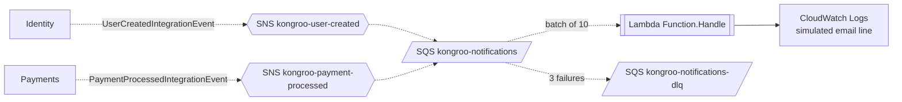

#  Kongroo.Notifications

Serverless notifications for FIAP Cloud Games (Phase 3). An **AWS Lambda** (.NET 10) triggered by an
**SQS queue** replaces the always-on NotificationsAPI container from Phase 2. It simulates email delivery
by writing structured log lines to **CloudWatch Logs**.

## How it is triggered



| Event                                         | Source   | Action                                       |
| --------------------------------------------- | -------- | --------------------------------------------- |
| `UserCreatedIntegrationEvent`                 | Identity | Logs a simulated welcome email               |
| `PaymentProcessedIntegrationEvent` (Approved) | Payments | Logs a simulated purchase-confirmation email |
| `PaymentProcessedIntegrationEvent` (Rejected) | Payments | Logs a skip line, no email                   |
| anything else                                 | —        | Logged and acknowledged                      |

The services publish through MassTransit's Amazon SQS transport (`Messaging__Transport=AmazonSqs`),
which writes the MassTransit JSON envelope to SNS. The subscriptions use raw message delivery, so the
function reads `messageType[0]` and `message` from the SQS body and deserializes the copied contracts in
`src/Kongroo.Identity.Contracts` and `src/Kongroo.Payments.Contracts`.

Malformed records are reported as partial batch failures, delivered up to 3 times (two retries), then
parked in the dead-letter queue. Unknown message types are acknowledged, not retried.

## Repository layout

```
template.yaml                 SAM: topics, queue, DLQ, subscriptions, function (LabRole)
samconfig.toml                stack kongroo-notifications, region us-east-1
samples/*.envelope.json       envelopes for manual `aws sns publish`
src/Kongroo.Notifications     Function.Handle + Application/NotificationHandler (pure) + Domain records +
                               aws-lambda-tools-defaults.json (runtime dotnet10, framework net10.0 — SAM
                               reads the TFM from here because Directory.Build.props owns it)
src/*.Contracts               copies of the publishers' event contracts
tests/Kongroo.Notifications.UnitTests
```

## Deploy (AWS Academy Learner Lab)

1. Start the lab, open **AWS Details → AWS CLI → Show**, paste the block into `~/.aws/credentials`.
2. `sam build && sam deploy` (first time creates the stack; later runs update it).
3. Watch: `sam logs --stack-name kongroo-notifications --name NotificationsFunction --tail`.
4. Deploy the stack **before** starting Identity/Payments with `Messaging__Transport=AmazonSqs`: the
   topic names are explicit, so if a service already created `kongroo-user-created` or
   `kongroo-payment-processed`, `sam deploy` fails with `AlreadyExists` — delete that topic
   (`aws sns delete-topic --topic-arn <arn>`) and redeploy; MassTransit reuses the stack-owned topic
   afterwards.

Tooling on a locked-down Windows machine: `dotnet tool install -g Amazon.Lambda.Tools`, and
`uv tool install aws-sam-cli --python 3.13` / `uv tool install awscli --python 3.13` when MSI
installers are blocked.

The function role is the lab's pre-created `LabRole` (Learner Lab forbids creating IAM roles).
Credentials expire with the session (~4 h); the deployed stack keeps running.

Manual trigger without the services:

```powershell
$topic = aws cloudformation describe-stacks --stack-name kongroo-notifications `
  --query "Stacks[0].Outputs[?OutputKey=='UserCreatedTopicArn'].OutputValue" --output text
aws sns publish --topic-arn $topic --message file://samples/user-created.envelope.json
```

## Tests

```bash
dotnet test tests/Kongroo.Notifications.UnitTests
```

No Docker needed. Tests cover envelope parsing, the event-to-email mapping, rejected and unknown
messages, and partial batch failure reporting.
